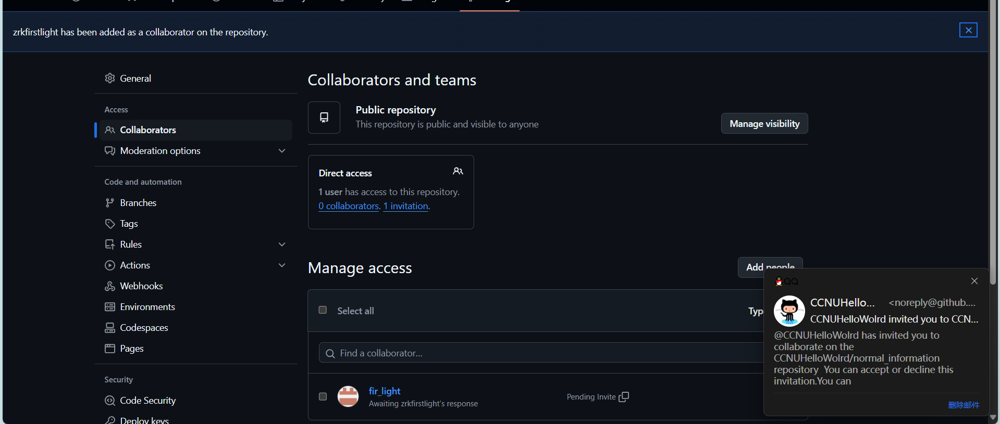

# github团队协作指南
首先介绍个人怎么使用github，然后介绍团队怎么使用github，最后说明协会对项目修改的规则。

应当注意，本指南不是教程，任何疑问请询问其他同学或者上网解决。

# 个人使用

## github介绍
GitHub是一个面向开源及私有软件项目的托管平台，
因为只支持Git作为唯一的版本库格式进行托管，
故名GitHub。很多优秀的代码以及各种框架源码都存放于github当中！

当谈及GitHub开源项目协作和版本控制时，
GitHub无疑是最受欢迎的平台之一。
无论你是个人开发者还是大型团队的一员，
GitHub都能提供强大的工具和功能，帮助你更高效地管理项目代码。

对于我们来讲，不知道要学习什么的时候，就去github上找项目学习。

## github使用

[新手保姆级使用教程](https://blog.csdn.net/molangmolang/article/details/136334746?ops_request_misc=&request_id=&biz_id=102&utm_term=github%E4%BD%BF%E7%94%A8%E6%95%99%E7%A8%8B&utm_medium=distribute.pc_search_result.none-task-blog-2~all~sobaiduweb~default-1-136334746.142^v102^pc_search_result_base8&spm=1018.2226.3001.4187)

**一般流程：**
1. 注册github账号
2. 安装git
3. 本地创建仓库
4. 将本地账号与云端账号绑定
5. 将云端仓库clone到本地
6. 提交本地commit
7. 将本地改动push到云端

**补充说明（常见问题或过往经验）：**

github登录问题：steam++游戏加速器有github通道，免费使用。或者自己翻墙。

## 实操
统一在cmd命令窗中进行操作
1. 推荐 在D盘或者E盘根目录创建文件夹  
进入文件夹路径，初始化git(创建本地仓库)

        d:  
        mkdir 文件夹名称
        cd 文件夹名称
        git init

2. 配置git信息，请看文档最后附录信息（待补充）

3. 将本地仓库与云端仓库连接

        clone https://github.com/CCNUHelloWolrd/normal_information.git

4. 查看本地文件夹中信息，将想要修改和提交的文档复制并覆盖到文件夹中

5. 编写提交备注，先将文件提交到本地，然后将本地仓库文件提交到云端

6. 查看云端信息（可能会有几分钟延迟）

# 团队使用

## 理论
[//]: # (待完善)
[github多人合作](https://blog.csdn.net/sculpta/article/details/104448310 "待补充")

浏览多人协作理论后，请前往[项目网址](https://github.com/CCNUHelloWolrd/normal_information)申请成为合作者
，或者直接找协会成员将你设定为协作者。

[账号管理者学习：如何将他人设为项目合作者](https://docs.github.com/zh/account-and-profile/setting-up-and-managing-your-personal-account-on-github/managing-access-to-your-personal-repositories/inviting-collaborators-to-a-personal-repository)

建议star项目

## 实操

维护者添加合作者：
进入项目，在设置栏中找到合作者菜单

点击添加人员，输入将要添加成员的github账号

添加成功效果（未成功请刷新界面，若半分钟后仍然未成功，重新操作，多次操作不成功，24小时后重试）

被邀请者应当在自己的账号上同意邀请

# 修改规则
1. 公共内容
协会每届指定多位同学进行信息维护，维护版本提交至develop分支。
每月指定时间点，由会长协商决定，将develop分支内容合并到main分支。
非信息维护者在项目中留言，由当届维护同学处理。
2. 个人内容
创建xxx_20xx分支，前面为姓名后面为年份，自由决定上传内容。

# 附录：

这些命令覆盖了日常开发中的大部分场景，建议结合实践逐步掌握

    1. 基础配置
    # 设置全局用户名和邮箱（提交时显示作者信息）
    git config --global user.name "Your Name"
    git config --global user.email "your.email@example.com"

    # 查看当前配置
    git config --list

    # 设置别名（例如用 `git co` 代替 `git checkout`）
    git config --global alias.co checkout

    2. 初始化与克隆仓库
    # 初始化本地仓库
    git init

    # 克隆远程仓库到本地
    git clone https://github.com/user/repo.git

    3. 添加与提交
    # 将文件添加到暂存区
    git add <file-name>       # 添加指定文件
    git add .                 # 添加所有修改过的文件（不包含未跟踪的新文件）
    git add -A                # 添加所有修改和未跟踪的文件

    # 提交暂存区的改动到本地仓库
    git commit -m "提交说明"
    
    # 跳过暂存区，直接提交已跟踪文件的修改
    git commit -a -m "提交说明"

    4. 分支管理
    # 查看分支列表（本地）
    git branch
    
    # 创建新分支
    git branch <branch-name>
    
    # 切换分支
    git checkout <branch-name>
    
    # 创建并切换到新分支
    git checkout -b <branch-name>
    
    # 合并分支（将指定分支合并到当前分支）
    git merge <branch-name>
    
    # 删除分支（已合并的分支）
    git branch -d <branch-name>
    # 强制删除未合并的分支
    git branch -D <branch-name>

    5. 远程仓库操作
    # 添加远程仓库
    git remote add origin https://github.com/user/repo.git
    
    # 查看远程仓库信息
    git remote -v
    
    # 推送本地分支到远程仓库
    git push origin <branch-name>
    # 首次推送并关联上游分支（后续可直接用 `git push`）
    git push -u origin <branch-name>
    
    # 拉取远程分支最新代码
    git pull origin <branch-name>
    
    # 从远程仓库拉取更新（不自动合并）
    git fetch origin

    6. 撤销与回退
    # 撤销工作区的修改（未 add 的改动）
    git checkout -- <file-name>
    
    # 撤销暂存区的修改（已 add 未 commit）
    git reset HEAD <file-name>
    
    # 回退到某个提交（保留工作区改动）
    git reset --soft <commit-hash>
    # 回退到某个提交（丢弃工作区改动）
    git reset --hard <commit-hash>
    
    # 修改最后一次提交的说明
    git commit --amend -m "新的提交说明"

    7. 查看状态与历史
    # 查看当前仓库状态
    git status
    
    # 查看提交历史
    git log
    # 简洁版提交历史（单行显示）
    git log --oneline
    # 查看分支合并历史（图形化）
    git log --graph --oneline
    
    # 查看某个文件的修改历史
    git blame <file-name>

    8. 标签管理
    # 创建标签（轻量标签）
    git tag <tag-name>
    # 创建带注释的标签
    git tag -a <tag-name> -m "标签说明"
    
    # 推送标签到远程仓库
    git push origin --tags

    9. 暂存工作区
    # 暂存当前工作进度（可切换分支或处理其他任务）
    git stash
    # 恢复暂存的工作进度
    git stash pop

    遇到问题时，可随时用 git --help 或 git <command> --help 查看详细文档。