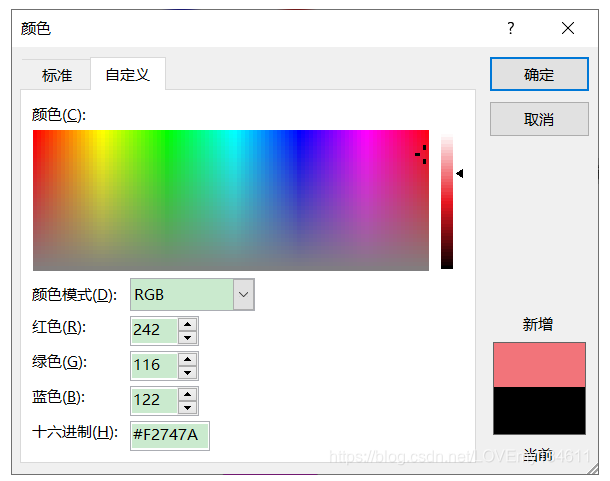

# OpenCV-Python实战

[学习链接](https://blog.csdn.net/LOVEmy134611/article/details/119489496)
### 安装
基本库

    pip install numpy

仅安装主模块包

    pip install opencv-python

安装完整包

    pip install opencv-contrib-python

### 图像处理基础
计算机视觉的目标，将2D数据转换为 *新的数据表示* *决策目标* *目标结果* *信息提取*
图像处理：
1. 读取图像
2. 图像处理（底层处理、中层处理、高层处理）
-- 1. 底层处理：图像去噪、锐化、归一化等
-- 4. 中层处理：图像提取主要特征、图像表示
-- 3. 输出结果
3. 显示结果

### 像素、颜色、通道、图像、颜色空间
一个图片有许多像素组成。  
像素大小取决于图像设置的每英寸像素数（PPI）
每个像素有不同的颜色模型进行表示，常见RGB模型。  
三原色RGB模型中，采用加法颜色模型，每个原色代表一个通道。
rgb图像表示24位深图像，参照颜色选择器。

### 图像描述
图像描述为2D函数f(x,y)，数字图像，对应x高度,y宽度处，图像的恋父、灰度、颜色值

### 图像文件类型
一般为RGB三元组矩阵
使用不同形式压缩图像，得到不同的文件格式。
压缩图像与原图像之间转换、压缩级别调整

### opencv处理图片
1. 坐标系 (x, y)表示列数、行数，（0, 0）表示左上角，（0， 5）表示第一行第六列像素
2. 通道顺序 BGR（历史原因）
3. 读取图像，并研究颜色通道堆图像的影响，见demo1.py
4. 在不同颜色空间中访问像素，，见demo1.py

