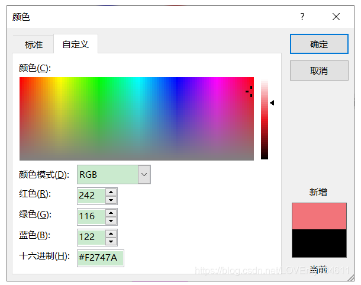

# OpenCV-Python实战

[学习链接](https://blog.csdn.net/LOVEmy134611/article/details/119489496)

[学习框架，仅作参考](https://blog.csdn.net/lovemy134611/category_10200958.html?utm_source=BWXQ_bottombtn&spm=1001.2101.3001.4225)
### 安装
基本库

    pip install numpy

仅安装主模块包

    pip install opencv-python

安装完整包

    pip install opencv-contrib-python

### 图像处理基础
计算机视觉的目标，将2D数据转换为 *新的数据表示* *决策目标* *目标结果* *信息提取*
图像处理：
1. 读取图像
2. 图像处理（底层处理、中层处理、高层处理）
-- 1. 底层处理：图像去噪、锐化、归一化等
-- 4. 中层处理：图像提取主要特征、图像表示
-- 3. 输出结果
3. 显示结果

### 像素、颜色、通道、图像、颜色空间
一个图片有许多像素组成。  
像素大小取决于图像设置的每英寸像素数（PPI）
每个像素有不同的颜色模型进行表示，常见RGB模型。  
三原色RGB模型中，采用加法颜色模型，每个原色代表一个通道。
rgb图像表示24位深图像，参照颜色选择器。

### 图像描述
图像描述为2D函数f(x,y)，数字图像，对应x高度,y宽度处，图像的恋父、灰度、颜色值

### 图像文件类型
一般为RGB三元组矩阵
使用不同形式压缩图像，得到不同的文件格式。
压缩图像与原图像之间转换、压缩级别调整

### opencv处理图片
1. 坐标系 (x, y)表示列数、行数，（0, 0）表示左上角，（0， 5）表示第一行第六列像素
2. 通道顺序 BGR（历史原因）
3. 读取图像，并研究颜色通道堆图像的影响，见demo1.py
4. 在不同颜色空间中访问像素，，见demo1.py

### 图像、视频I/O流
输入： 图像或视频
cv2.imread()  

输出： 图像、视频或模型信息
cv2.imshow()  
cv2.imwrite() 

图像和不同类型的文件通常作为命令行参数传递给脚本

关于**图像处理**利用下述命令行运行脚本，脚本信息在文件中有注释

    python demo2_load_image.py rgb.png
    python demo3_write_image.py rgb.png rgb1.png
    python demo4_load_processing_save_image.py rgb.png rgb1.png

关于**视频处理**利用下述命令行运行脚本，脚本信息在文件中有注释

请先看完脚本再运行代码，实时处理电脑摄像头信息

    python demo5_read_camera.py 0
    python demo6_read_camera_capture.py 0
    python demo7_write_camera.py 0

请先看完脚本再运行代码，处理已有视频

    python demo8_read_video_file.py example.mp4

实时处理ip摄像头，仅需额外添加构造函数即可，参照demo9_ip_camera.py  
由于公网ip摄像头很少，这个后续有条件自己搭建自己的即可。

### 自动计算视频fps

请先看完脚本再运行代码，直接运行 demo10_read_camera_fps.py 即可

### 视频编解码器
压缩或者解压视频文件的编解码器。  
opencv支持 fourcc(一个4字节编码)，用于指定视频编解码器。  
想要使用编解码器应当在系统安装对应平台的编解码器。  
经典编解码器： DIVX、XVID、X264、MJPG.
常见的储存数字视频数据的文件格式， avi, mp4, mov, wmv.
opencv中创建视频文件需要考虑： 图片序列、fourcc、width、height、fps、file_name..

请先看完脚本再运行代码，利用下述命令行运行脚本，脚本信息在文件中有注释
    
    python demo11_write_video_file.py example.avi

### 查看视频对象的属性

补充python数字与asc码的转换关系

    c = input("请输入一个字符: ")
    a = int(input("请输入一个ASCII码: "))
    print( c + " 的ASCII 码为", ord(c))
    print( a , " 对应的字符为", chr(a))

请先看完脚本再运行代码，利用下述命令行运行脚本，脚本信息在文件中有注释

    python demo12_read_video_file_properties.py example.mp4
    python demo13_read_video_file_backwards.py example.mp4

